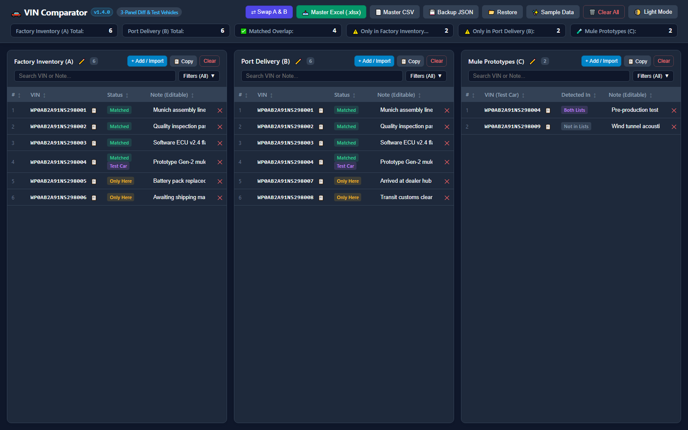

# 🚗 VIN Tri-Panel Comparator & Test Vehicle Filter `v1.4.0`

[](https://cj-1981.github.io/vin-compare/)
[](https://github.com/CJ-1981/vin-compare/actions/workflows/deploy-pages.yml)
[](https://github.com/CJ-1981/vin-compare)

> **Live Web App:** [https://cj-1981.github.io/vin-compare/](https://cj-1981.github.io/vin-compare/)

A standalone, high-performance HTML/JS/CSS tool for comparing two lists of Vehicle Identification Numbers (VINs) while ignoring/flagging known test vehicles.



---

## 🌟 Key Features

1. **3-Panel Dashboard Layout:**
   - **List A (Baseline):** Primary source VIN list.
   - **List B (Comparison):** Target comparison VIN list.
   - **List C (Test Vehicles):** Known test vehicles to flag and exclude from discrepancy counts.
   - Clean, modern, distraction-free neutral borders without colored edge halos.
2. **List Renaming with Dynamic Text Sizing:**
   - Click any panel header title or the `✏️` edit button to rename `List A`, `List B`, or `List C` to custom labels (e.g., `Factory Inventory`, `Port Delivery`, `Mule Prototypes`).
   - Dynamic font-size scaling prevents long titles from ever wrapping into multi-line rows or displacing toolbar buttons.
   - Custom names dynamically propagate across live metrics counters, import dialogs, Master Excel sheets/metrics, and CSV exports.
3. **Non-Destructive Sample Data Toggle:**
   - Click **`✨ Sample Data`** to inspect realistic preloaded demonstration data without losing your current workspace.
   - Click **`✨ Hide Sample`** to immediately restore your previously entered data, custom titles, and sorting preferences.
4. **Multi-Select Status Filter Dropdown with Dynamic Counts:**
   - Popover dropdown filter in each panel allowing independent multi-selection of statuses: `Matched`, `Matched (Test Car)`, `Only Here`, and `Test Vehicle (Ignored)`.
   - **Live Counts & Smart Availability:** Displays real-time matching counts per status (e.g. `Matched (3)`) and automatically hides statuses with 0 entries in that list.
   - **Dual Badging & Filtering:** Vehicles satisfying both conditions (found in A and B, plus listed in C) receive dual badges `[Matched] [Test Car]` and can be filtered or isolated with `Matched (Test Car)`.
   - Includes quick **"Select All"** and **"Clear"** buttons with live button labels reflecting selected count.
5. **Interactive & Persisted Column Sorting:**
   - Click any column header (`#`, `VIN`, `Status`/`Detected In`, `Note`) to cycle between **Ascending (`▲`)**, **Descending (`▼`)**, and **Default Index Order**.
   - Sort state is maintained independently per panel and persists automatically across page reloads and JSON workspace backups.
6. **Real-time Filtered Count in Column Headers:**
   - Header count badges (`#count-a`, `#count-b`, `#count-c`) automatically display `visible / total` (e.g. `2 / 6`) when filters or search queries are active.
7. **Spacious Add & Batch Import Modal Window:**
   - Large, comfortable vertical modal (`86vh` height, max 900px width) with smooth scrollbar.
   - Live counter dynamically reporting **"Lines: X | Valid VINs detected: Y"** as you type or paste.
   - 1-click **"📋 Paste Clipboard"** and **"Clear"** shortcuts.
   - Supports long vertical lists of VINs (newline, comma, semicolon, or tab-delimited with notes), plus drag-and-drop for `.xlsx`, `.xls`, `.csv`, `.txt`.
8. **List Swap (A ⇄ B):**
   - Instant 1-click swap button (`⇄ Swap A & B`) in the header toolbar to exchange contents between List A and List B with real-time recalculation.
9. **Inline Editable Notes:**
   - Dedicated Note column for every VIN across all 3 panels.
   - Edit notes directly in the table; changes are automatically persisted.
10. **Local Offline Persistence:**
    - Automatic debounced synchronization to browser `localStorage`.
    - Full workspace JSON backup & restore.
11. **Excel & CSV Export:**
    - **Master Excel (.xlsx):** Multi-sheet workbook with Summary metrics, Matched Overlap, Only in List A, Only in List B, and Test Vehicles, using your custom list names.
    - **Master CSV (.csv):** Consolidated export with all columns, statuses, and custom list names.

---

## 🚀 How to Run

1. Simply double-click [**`index.html`**](file:///c:/Users/Chimin.Jung/OneDrive%20-%20Lotus%20Tech%20Innovation%20Centre%20GmbH/Documents/Obsidian%20Vault/scripts/vin-compare/index.html) to open it directly in Chrome, Edge, Safari, Firefox, or inside an Obsidian webview.
2. No server, build tools, or internet connection required.

---

## 🧪 Running Automated Tests

Run the test suite using Node.js:
```bash
npm test
```
